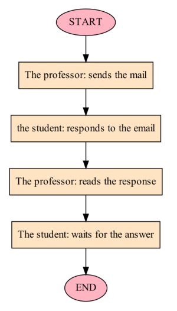
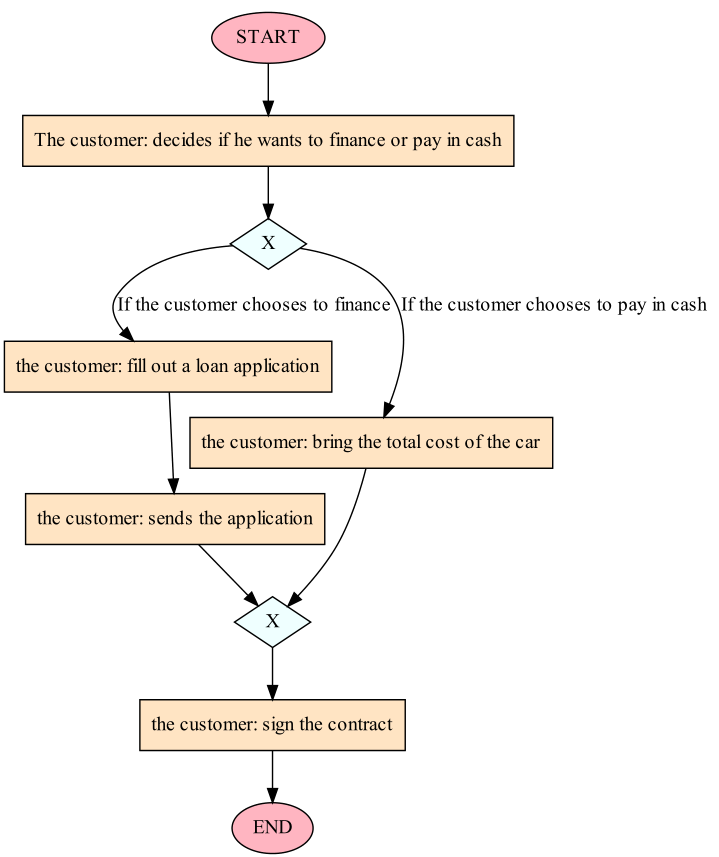
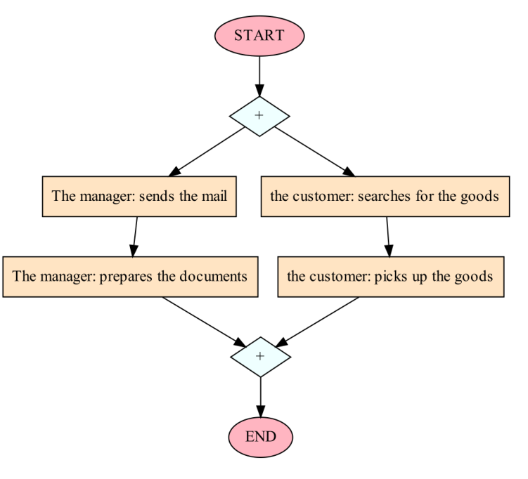

# Process visualizer

This is an application that aims to convert textual descriptions of processes into simplified BPMN diagrams using [Graphviz](https://graphviz.org/).

The app supports the following BPMN elements:

* tasks
* exclusive gateways
* parallel gateways
* start and end events

## Example inputs and outputs

### Example #1

*The process begins when the student logs in to the university's website. He then takes an online exam. After that, the system grades it. If the student scores below 60%, he takes the exam again. If the student scores 60% or higher on the exam, the professor enters the grade.*

### Example #2

*The customer decides if he wants to finance or pay in cash. If the customer chooses to finance, the customer will need to fill out a loan application. After that, the customer sends the application to the bank. If the customer chooses to pay in cash, the customer will need to bring the total cost of the car to the dealership in order to complete the transaction. After the customer has chosen to finance or pay in cash, the customer must sign the contract before the transaction is completed.*

### Example #3

*The manager sends the mail to the supplier and prepares the documents. At the same time, the
customer searches for the goods and picks up the goods.*

### Example #4

*The customer decides if he wants to finance or pay in cash. If the customer chooses to finance, the
customer will need to fill out a loan application. Meanwhile, the manager checks the customer's info.
If the customer chooses to pay in cash, the customer will need to bring the total cost of the car to
the dealership in order to complete the transaction.*

